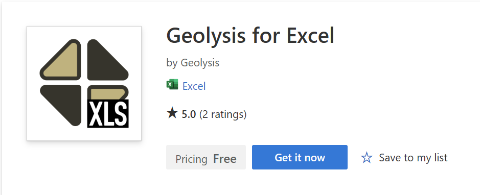

<div align="center">

</div><br>

<div align="center">

[](https://pypi.org/project/geolysis/)
[](https://pepy.tech/projects/geolysis)
[](https://pypi.python.org/pypi/geolysis/)
[](https://opensource.org/license/mit/)


[](https://app.codacy.com/gh/patrickboateng/geolysis/dashboard?utm_source=gh&utm_medium=referral&utm_content=&utm_campaign=Badge_grade)
[](https://github.com/patrickboateng/geolysis/actions/workflows/geolysis-unit-tests.yml)
[](https://geolysis.readthedocs.io/en/latest/?badge=latest)

</div>

`geolysis` is an open-source python package (library) for geotechnical analysis
and modeling.

The `geolysis` python package is among three other projects, `geolysis.excel`,
`geolysis.gui`, and `geolysis.ai`. More details about these projects are
provided [here](https://github.com/geolysis-dev).

> [!IMPORTANT]
> The `geolysis.excel` (an Excel Add-in), is available to install from the
> Microsoft AppSource Store using this installer
> link: [https://appsource.microsoft.com/en-us/product/Office365/WA200009428](https://appsource.microsoft.com/en-us/product/Office365/WA200009428)



`geolysis` has only one project dependency which
is [func-validator](https://github.com/patrickboateng/func-validator/)
for validating `function` (and `method`) arguments.

The rest of this **README** provides an overview of the `geolysis` python
package.

## Table of Contents

- [Installation](#installation)
- [API Reference](#api-reference)
- [Imports](#imports)
- [Project Structure](#project-structure)
- [Usage](#usage)
- [Documentation](#documentation)
- [Contributing](#contributing)
- [License](#license)
- [Contact](#contact)

## Installation

```shell
$ pip install geolysis
```

## API Reference

- [Python API](https://docs.geolysis.io/en/latest/reference/)
    - [geolysis.bearing_capacity.abc](https://docs.geolysis.io/en/latest/reference/allowable_bearing_capacity/) -
      _Allowable bearing capacity
      estimation_
    - [geolysis.bearing_capacity.ubc](https://docs.geolysis.io/en/latest/reference/ultimate_bearing_capacity/) -
      _Ultimate bearing capacity
      estimation_
    - [geolysis.foundation](https://docs.geolysis.io/en/latest/reference/foundation/) -
      _Foundation Representation_
    - [geolysis.soil_classifier](https://docs.geolysis.io/en/latest/reference/soil_classifier/) -
      _Soil classification_
    - [geolysis.spt](https://docs.geolysis.io/en/latest/reference/spt/) -
      _Standard Penetration Test (SPT) Analysis_
    - [geolysis.utils](https://docs.geolysis.io/en/latest/reference/utils/) -
      _Utilities_

## Imports

### Bearing Capacity

- **Allowable Bearing Capacity (ABC)**

    ```python
    from geolysis.bearing_capacity.abc import create_abc_4_cohesionless_soils
    ```

- **Ultimate Bearing Capacity (UBC)**

  ```python
  from geolysis.bearing_capacity.ubc import create_ubc_4_all_soil_types
  ```

### Foundation

```python
from geolysis.foundation import create_foundation
```

### Soil Classification

```python
from geolysis.soil_classifier import create_uscs_classifier
from geolysis.soil_classifier import create_aashto_classifier
```

### Standard Penetration Test (SPT) Analysis

  ```python
  from geolysis.spt import DilatancyCorrection
  from geolysis.spt import EnergyCorrection
  from geolysis.spt import SPT
  from geolysis.spt import create_overburden_pressure_correction
  ```

## Project Structure

These are the main components of the project structure

    .
    ├── .github            # GitHub Actions
    ├── docs               # Documentation files
    ├── geolysis           # Source files
    ├── tests              # Automated tests
    ├── pyproject.toml     # Project configuration file
    └── README.md          # Project README file

## Usage

```python

>>> from geolysis.soil_classifier import create_aashto_classifier
>>> aashto_clf = create_aashto_classifier(liquid_limit=34.1,
...                                       plastic_limit=21.1,
...                                       fines=47.88, )
>>> clf = aashto_clf.classify()
>>> clf.symbol
'A-6(4)'
>>> clf.symbol_no_group_idx
'A-6'
>>> clf.group_index
'4'
>>> clf.description
'Clayey soils'

```

Check out more [examples](https://docs.geolysis.io/en/latest/usage/)

## Documentation

Check out the full [documentation](https://docs.geolysis.io/en/latest/).

## Contributing

Check out
the [contribution guidelines](https://docs.geolysis.io/en/latest/dev_guide/)

## License

This project is licensed under the MIT License - see the
[LICENSE](https://github.com/patrickboateng/geolysis/blob/main/LICENSE.txt)
file for more details.

## Contact

For questions or feedback, please
contact [patrickboateng at patrickboateng dot tech](mailto:patrickboateng@patrickboateng.tech)
